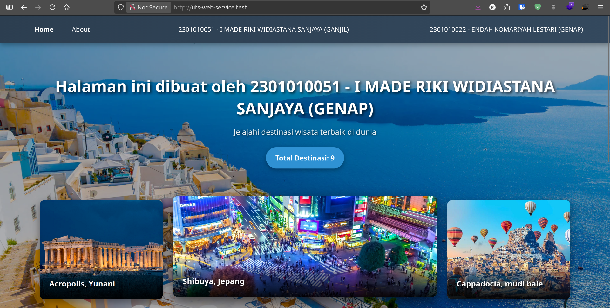
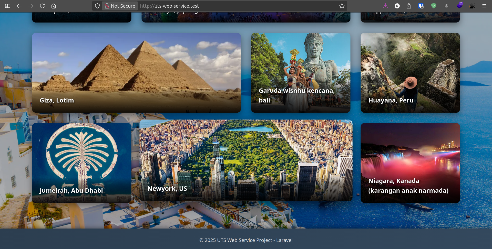

# UTS Web Service - Laravel Project

Proyek Ujian Tengah Semester untuk Mata Kuliah Web Service yang dibuat menggunakan Laravel 11 dengan fokus pada implementasi MVC pattern, Blade templating, dan kolaborasi tim menggunakan Git.

## Informasi Project

**Mata Kuliah:** Web Service  
**Jenis Ujian:** Ujian Tengah Semester (UTS)  
**Soal:** Nomor 2 (Pasangan NIM Mix Ganjil & Genap)  
**Framework:** Laravel 11  
**Development Environment:** Laravel Herd

## Tim Pengembang

### Mahasiswa A (Repository Owner)

-   **Nama:** I Made Riki Widiastana Sanjaya
-   **NIM:** 2301010051
-   **Role:** Master Repository & Base Project Developer

### Mahasiswa B (Collaborator)

-   **Nama:** Endah Komariyah Lestari
-   **NIM:** 2301010022
-   **Role:** Feature Developer & Branch Contributor
-   **Branch:** `endah`

## Deskripsi Project

Project ini merupakan implementasi website sederhana yang mendemonstrasikan kemampuan mahasiswa dalam:

1. Membangun aplikasi web menggunakan Laravel framework
2. Mengimplementasikan arsitektur Model-View-Controller (MVC)
3. Menggunakan Blade templating engine dengan layout system
4. Mengelola routing dengan baik dan terstruktur
5. Berkolaborasi menggunakan Git dan GitHub

### Fitur Utama

Project ini terdiri dari beberapa halaman utama:

-   **Home (Beranda):** Halaman utama yang menampilkan informasi umum website
-   **About (Tentang):** Halaman yang berisi informasi tentang penulis/pengembang

## Preview Halaman

### Halaman Home

Halaman home menampilkan destinasi wisata dalam grid layout yang responsif dan interaktif.





**Fitur Halaman Home:**

-   Hero section dengan informasi pembuat
-   Badge counter yang menampilkan total destinasi (menggunakan function count dari Model)
-   Grid layout dengan 9 destinasi wisata
-   Card interaktif dengan hover effect
-   Responsive design untuk berbagai ukuran layar
-   Background image dengan overlay untuk readability

## Ketentuan & Requirement

Berdasarkan ketentuan UTS yang diberikan, project ini harus memenuhi kriteria berikut:

1. **Laravel Setup:** Project dibuat menggunakan Laravel Herd
2. **Blade Templating:** Implementasi Blade templating dan directive (layouts) untuk efisiensi kode
3. **Route Management:** Pengelolaan route yang bersih dengan logic dipindahkan ke controller
4. **MVC Implementation:** Integrasi penuh Model, View, dan Controller
5. **Data Handling:** Implementasi model dengan function count untuk menghitung jumlah data
6. **Git Collaboration:** Kolaborasi tim menggunakan GitHub dengan branch workflow

## Struktur Project

```
uts-web-service/
├── app/
│   ├── Http/
│   │   └── Controllers/     # Controller untuk handle logic
│   ├── Models/              # Model untuk data management
│   └── Providers/
├── resources/
│   ├── views/               # Blade templates
│   │   └── layouts/         # Layout templates
│   ├── css/                 # Styling
│   └── js/                  # JavaScript files
├── routes/
│   └── web.php              # Route definitions
├── public/
│   └── images/              # Asset gambar dari soal
└── database/
    ├── migrations/          # Database migrations
    └── seeders/             # Database seeders
```

## Teknologi yang Digunakan

-   **Backend:** Laravel 11
-   **PHP Version:** 8.2+
-   **Frontend:** Blade Template Engine
-   **Styling:** CSS/Tailwind CSS
-   **Development Tool:** Laravel Herd
-   **Version Control:** Git & GitHub

## Instalasi & Setup

### Prerequisites

-   PHP 8.2 atau lebih tinggi
-   Composer
-   Laravel Herd (atau Laravel Valet/Homestead)
-   Git

### Langkah Instalasi

1. Clone repository ini:

```bash
git clone https://github.com/RikiSanjayaa/uts-web-service.git
cd uts-web-service
```

2. Install dependencies:

```bash
composer install
```

3. Copy file environment:

```bash
cp .env.example .env
```

4. Generate application key:

```bash
php artisan key:generate
```

5. Jalankan migrasi database (jika diperlukan):

```bash
php artisan migrate
```

6. Jalankan aplikasi menggunakan Laravel Herd atau:

```bash
php artisan serve
```

7. Akses aplikasi di browser:

```
http://localhost:8000
```

## Workflow Kolaborasi Git

### Branch Strategy

-   **Branch `main`:** Branch utama yang berisi kode stabil
-   **Branch `endah`:** Branch feature development (Mahasiswa B)

### Workflow Collaboration

1. **Mahasiswa A:** Membuat base project dan push ke GitHub
2. **Mahasiswa B:**
    - Fork atau clone repository
    - Membuat branch baru `endah`
    - Develop features di branch tersebut
    - Commit dan push changes
    - Membuat Pull Request ke branch `master`
3. **Mahasiswa A:** Review dan merge Pull Request dari Mahasiswa B

### Git Commands Reference

```bash
# Clone repository
git clone https://github.com/RikiSanjayaa/uts-web-service.git

# Membuat branch baru (Mahasiswa B)
git checkout -b endah

# Melihat status perubahan
git status

# Menambahkan perubahan
git add .

# Commit perubahan
git commit -m "Deskripsi perubahan"

# Push ke branch
git push origin endah

# Update dari branch master
git pull origin master
```

## Implementasi yang Akan Dikembangkan

### 1. Blade Layouts

-   Master layout dengan section untuk header, content, dan footer
-   Reusable components untuk navigation dan UI elements

### 2. Controllers

-   `HomeController`: Menangani logic halaman home
-   `AboutController`: Menangani logic halaman about

### 3. Models & Data

-   Model untuk mengelola data
-   Implementation function `count()` untuk menghitung jumlah data
-   Seeder untuk data dummy

### 4. Views

-   `home.blade.php`: Template halaman home
-   `about.blade.php`: Template halaman about
-   `layouts/app.blade.php`: Master layout template

### 5. Routes

```php
// Contoh struktur routing yang akan diimplementasi
Route::get('/', [HomeController::class, 'index'])->name('home');
Route::get('/about', [AboutController::class, 'index'])->name('about');
```

## Referensi Design

Design reference dan asset gambar dapat dilihat di folder `public/images/`:

-   `halaman home.png` - Mockup halaman home
-   `halaman about.png` - Mockup halaman about
-   Asset gambar lainnya untuk konten website

## Link Repository

**GitHub Repository:** [https://github.com/RikiSanjayaa/uts-web-service](https://github.com/RikiSanjayaa/uts-web-service)

Repository ini dibuat public agar dapat diakses oleh dosen pengampu untuk penilaian.

## Catatan Pengembangan

-   Project ini dikembangkan sebagai bagian dari penilaian UTS
-   Fokus utama adalah demonstrasi kemampuan teknis dan kolaborasi tim
-   Kode ditulis dengan standar best practices Laravel
-   Dokumentasi dan commit message dibuat sejelas mungkin

## Lisensi

Project ini dibuat untuk keperluan edukasi dalam rangka UTS Mata Kuliah Web Service.

**Dikembangkan dengan Laravel 11**  
**Tahun Akademik:** 2025

The Laravel framework is open-sourced software licensed under the [MIT license](https://opensource.org/licenses/MIT).
